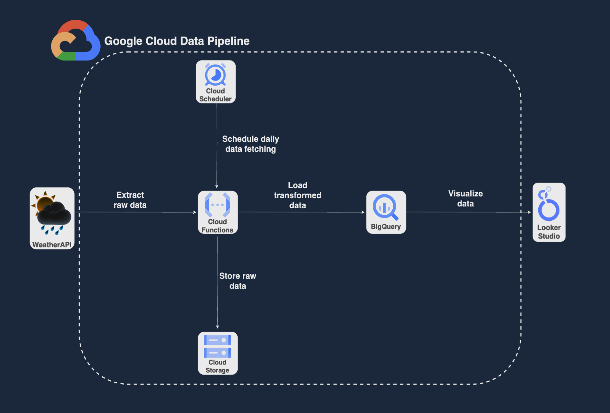

# MNGMT-ACCESS-FINAL
MNGMT-ACCESS-FINAL PROJ

The methodology employed in this project involves several key steps:
- **API Interaction**: Automated data extraction from the OpenWeather API,
https://openweathermap.org/ to retrieve weather data.
- **Data Manipulation**: Utilization of Python and Pandas for data cleaning and transformation to
prepare it for analysis.
- **Cloud Services Deployment**: Deployment of automated ETL workflows on Google Cloud
Platform (GCP) to extract, process, and store data. Services utilized include Cloud Functions,
Cloud Scheduler, BigQuery, and Cloud Storage.
- **Data Visualization**: Creation of an interactive dashboard using Looker Studio to visualize
insights derived from the analyzed weather data.

